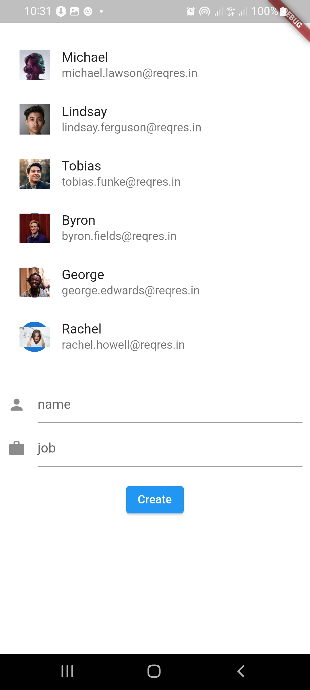
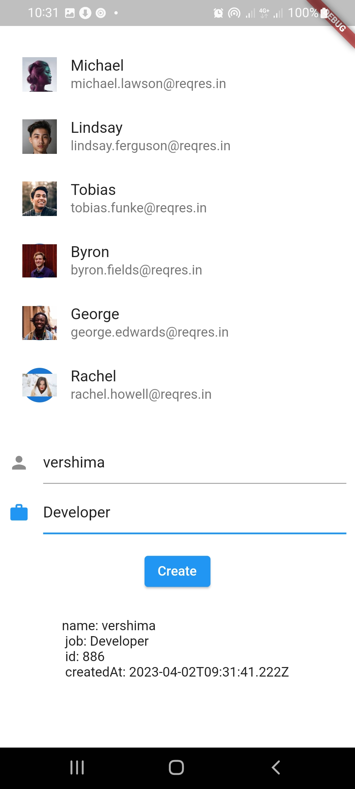
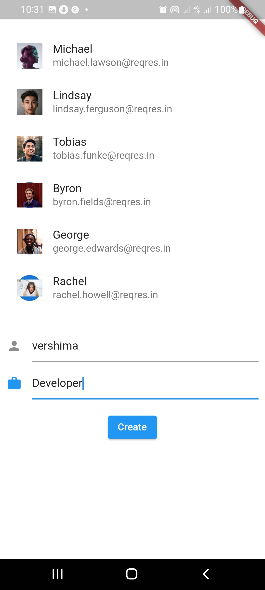

<h3 align="center">Ziggy Task</>
    

##Overview
Basically what i did was to first call the get user endpoint which i displayed it using a listview, so on app launch the endpoint is called and the response is displayed using a listtile. Just below the listview is a set of Textformfield to take in user input for the post request which is the second endpoint i am ment to implement, the response gotten is then displayed just below the textformfields which is the name of inputed by user, id , job and when it was created.

## Installation and Usage
To run the source code in your IDE, clone the repo

*--  git clone https://github.com/VershimaKelvin/Projerctwork*

after cloning, get all the dependencies by running

*-- flutter pub get*

The apk can be gotten from this link https://drive.google.com/file/d/1uZOEhBooJiD0hC3rknJys7x_rPVa7Ycu/view?usp=sharing

## ScreenShots

Here are some screenshootes taken from an android device

|               Screen column1                |               Screen column2                |               Screen column3                |
|:-------------------------------------------:|:-------------------------------------------:|:-------------------------------------------:|
|        |        |        |

